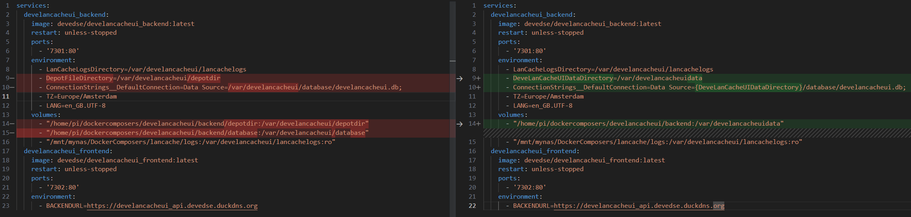
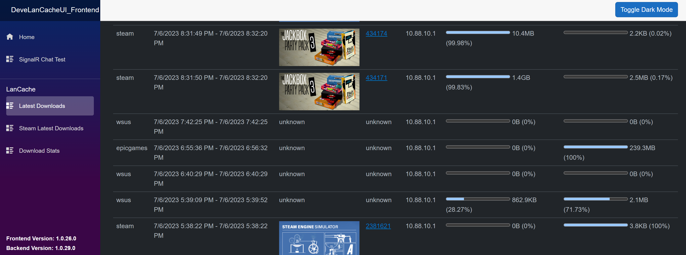
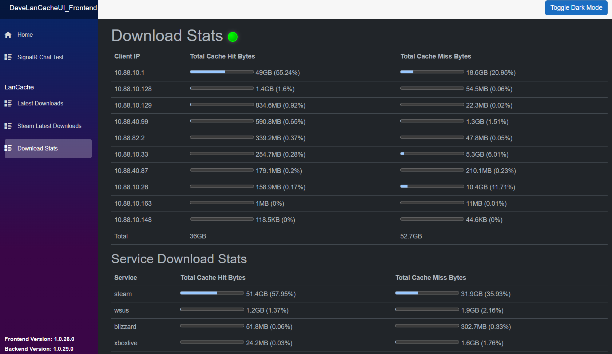
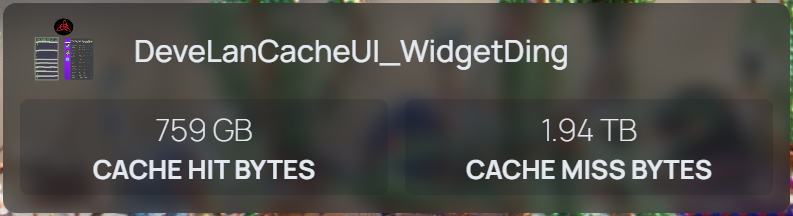

# DeveLanCacheUI_Backend
A UI for Lan Cache.

** Important Upgrade Guide**

As of version 1.0.57 you need to migrate to a new Docker-Compose.yml. Here's how:



Note: Also add the DNS line if you errors in the container logs that it can't get the manifests due to a 401 unauthorized

## Screenshots

Can show Steam Games that were downloaded / cached:


Can show other Download events:


Can show client / service stats:


## Homepage integration

It's also possible to integrate DeveLanCacheUI with [Homepage](https://gethomepage.dev/):

[Learn More](https://gethomepage.dev/latest/widgets/services/develancacheui/)

## How to run this

Steps:
1. Create/mount the relevant directories
1. Update the docker-compose.yml with your own URL's / paths. Changing the TZ and LANG only impact the way the container logs. (E.g. 23/04/2023 instead of 04/23/2023)
1. Run the docker-compose file
1. Github Sponsor me 5k euro's kthnx
1. Profit

### Minimal Setup

This setup is meant to work and change as little configuration values as possible.
Only change the host part of the volumes and the DNS.

docker-compose.yml:

```
version: '3'

services:
  develancacheui_backend:
    image: devedse/develancacheui_backend:latest
    restart: unless-stopped
    ports:
      - '7301:80'
    environment:
      - TZ=Europe/Amsterdam
      - LANG=en_GB.UTF-8
    volumes:
      - "/home/pi/dockercomposers/develancacheui/backend:/var/develancacheuidata"
      - "/mnt/mynas/DockerComposers/lancache/logs:/var/develancacheui/lancachelogs:ro"
    dns:
      - 10.88.20.254
  develancacheui_frontend:
    image: devedse/develancacheui_frontend:latest
    restart: unless-stopped
    ports:
      - '7302:80'
    environment:
      - BACKENDURL=http://10.88.20.2:7301 #iclude http/https here
      - AllowedHosts=*
```

### Advanced setup

It's possible that you want to configure more, here's an example for that.

docker-compose.yml:

```
version: '3'

services:
  develancacheui_backend:                           # needs to be named exactly like this if using magic 'reverseproxyapi'
    image: devedse/develancacheui_backend:latest
    restart: unless-stopped
    ports:
      - '7301:80'
    environment:
      - LanCacheLogsDirectory=/var/develancacheui/lancachelogs
      - DeveLanCacheUIDataDirectory=/var/develancacheuidata
      - ConnectionStrings__DefaultConnection=Data Source={DeveLanCacheUIDataDirectory}/database/develancacheui.db;
      - TZ=Europe/Amsterdam
      - LANG=en_GB.UTF-8
      - Feature_DirectSteamIntegration=true
      - Feature_SkipLinesBasedOnBytesRead=true
    volumes:
      - "/home/pi/dockercomposers/develancacheui/backend:/var/develancacheuidata"
      - "/mnt/mynas/DockerComposers/lancache/logs:/var/develancacheui/lancachelogs:ro"
    dns:
      - 10.88.20.254
  develancacheui_frontend:
    image: devedse/develancacheui_frontend:latest
    restart: unless-stopped
    ports:
      - '7302:80'
    environment:
      - BACKENDURL=http://10.88.20.2:7301 #iclude http/https here                           
      - AllowedHosts=*
```

Note: You could also configure a Reverse Proxy (Like Nginx Proxy Manager) to handle CORS. This would allow you to remove the following environment variable (See: https://github.com/devedse/DeveLanCacheUI_Backend/issues/49):
```
- AllowedHosts=*
```

### Actual Steam Automatic Update Integration

tpil90 helped me build a feature where the application actually integrates with the Steam API to constantly watch for updated depots. This feature can be activated by adding the following lines to the environment of the backend:

```
services:
  develancacheui_backend:
    ...
    environment:
      - Feature_DirectSteamIntegration=true
      - Feature_SkipLinesBasedOnBytesRead=true
    ...
```

This should now all works quite neatly, if it doesn't, let me know in a github issue :smile:.

### table with explanation on variables

**Environment Variables Backend**

| Variable  | Explanation | Default | 
| -- | -- | -- |
| LanCacheLogsDirectory | The internal folder inside the container the backend tries to look for the lancache log files. Ideally don't touch this. | /var/develancacheui/lancachelogs |
| DeveLanCacheUIDataDirectory | The internal folder inside the container the backend stores all it's data. Ideally don't touch this. | /var/develancacheuidata |
| ConnectionStrings__DefaultConnection | The connection string used with SQLite. Ideally don't touch this. | Data Source={DeveLanCacheUIDataDirectory}/database/develancacheui.db; |
| TZ | Set this to your timezone | ?? |
| LANG | Set this to your language | ?? |
| Feature_DirectSteamIntegration | When false, the backend will download a .CSV file with all depot => steam game mappings (from: https://github.com/devedse/DeveLanCacheUI_SteamDepotFinder_Runner/releases). When true, the tool wil generate this itself / keep it up to date. I would suggest turning this on. | false (for now) |
| Feature_SkipLinesBasedOnBytesRead | When false, it will re-read through the whole file on startup. When true, it tries to be smart and start reading from where it last left off. I would suggest turning this on. | false (for now) |

**Volume Mounts Backend**

| Path  | Explanation | 
| -- | -- |
| - "/home/pi/dockercomposers/develancacheui/backend:/var/develancacheuidata" | Change the part before the `:` to an empty data directory |
| - "/mnt/mynas/DockerComposers/lancache/logs:/var/develancacheui/lancachelogs:ro" | Change the part before the `:` to the log directory for lancache |

**Environment Variables Backend**
| Variable  | Explanation | Default | 
| -- | -- | -- |
| AllowedHosts | Sets the HOSTS header for CORS. Leave at * unless you know what you're doing | * |
| BACKENDURL | The backend url where the frontend connects to. Since this is usually a different domain you need to setup CORS correctly. See *1 | N/A |


1.  CORS can be quite hard to setup. So I added a secret magic flag: `BACKENDURL=reverseproxyapi` If you enter this the frontend itself will forward the requests to the backend over the docker internal network. The url is hardcoded to `http://develancacheui_backend:80` so please ensure you leave the servicename exactly like that: `develancacheui_backend`. Else docker won't be able to resolve this.

## Automatic updates

I would strongly suggest setting up https://github.com/containrrr/watchtower for this. It works amazing.

## How it works

DeveLanCacheUI_Backend starts by reading through the whole access.log file generated by LanCache.
Besides processing the whole existing access.log file, it will also 'watch' the file for new log lines.
All log lines that were already processed before are skipped.
It parses every line and tries to create "DownloadEvents". A download event is an event that starts at a specific point in time and ends.
Download events are separated/grouped by a unique identifier: clientIp, service, downloadIdentifier (some unique identifier, e.g. DepotId for Steam. Not all services have this)
All new log lines that happen within 5 minutes of the last update of the download event with the same unique identifier will be grouped.

Let's say at 00:00 we start downloading CounterStrike on steam. A unique identifier is made: 192.168.2.123,steam,2347771
If a new log entry with the same unique identifier is found, it's searching the db for past event that were updated in the last 5 minutes.
If that's the case, this log entry is appended to the existing download event.

This results in download events being specific instances of a certain client download a certain application/update/game.

## Issue: My access.log file is updated but my DeveLanCacheUI_Backend isn't reading the new lines

So apparently if the access.log file is in a SMB Share which is mounted in docker (as is the case for me) the DeveLanCacheUI_Backend application takes a READ lock on the share. This apparently lets CIFS decide that no other applications will write to this file which allows it to cache things.
If you manually execute the `ls` command in the lancachelogs directory it will in fact start reading the file again.

To work around this issue you need to add `cache=none` to the CIFS mount in `/etc/fstab`:
```
//192.168.2.201/DockerComposers /mnt/mynas/DockerComposers cifs credentials=/home/pi/.mynascredentialssmb,iocharset=utf8,vers=3.0,sec=ntlmssp,cache=none 0 0
```

References:
https://stackoverflow.com/questions/14920591/how-to-disable-caching-in-cifs-samba-on-client-side-in-linux
https://www.samba.org/samba/docs/old/Samba3-HOWTO/locking.html
https://linux.die.net/man/8/mount.cifs

## Progress / Plans

| Task | Progress |
|:----:|:--------:|
| Automated Deployments | 100% |
| Dockerization | 100% |
| Implement other services besides steam | 80% (I don't show games for other services yet) |
| Auto refresh | 100% |
| More data things | 80% (We have stats now) |
| Dark Theme + Toggle | 100% (A bit jank, but it works) |

## Related projects

| Project | Explanation |
| -- | -- |
| [DeveLanCacheUI_Backend](https://github.com/devedse/DeveLanCacheUI_Backend/) | The main project. Contains the readme. |
| [DeveLanCacheUI_Frontend](https://github.com/devedse/DeveLanCacheUI_Frontend/) | The Frontend. |
| [DeveLanCacheUI_SteamDepotFinder](https://github.com/devedse/DeveLanCacheUI_SteamDepotFinder) | A tool to generate the mapping for steam depots and games. Kinda deprecated when `Feature_DirectSteamIntegration` is set to true |
| [DeveLanCacheUI_SteamDepotFinder_Runner](https://github.com/devedse/DeveLanCacheUI_SteamDepotFinder_Runner) | Runs the SteamDepotFinder on a weekly basis. |

## Build status

| GitHubActions Builds |
|:--------------------:|
| [](https://github.com/devedse/DeveLanCacheUI_Backend/actions/workflows/githubactionsbuilds.yml) |

## DockerHub

| Docker Hub |
|:----------:|
| [](https://hub.docker.com/r/devedse/develancacheui_backend/) |

## Code Coverage Status

| CodeCov |
|:-------:|
| [](https://codecov.io/gh/devedse/DeveLanCacheUI_Backend) |

## Code Quality Status

| SonarQube |
|:---------:|
| [](https://sonarcloud.io/dashboard?id=DeveLanCacheUI_Backend) |
