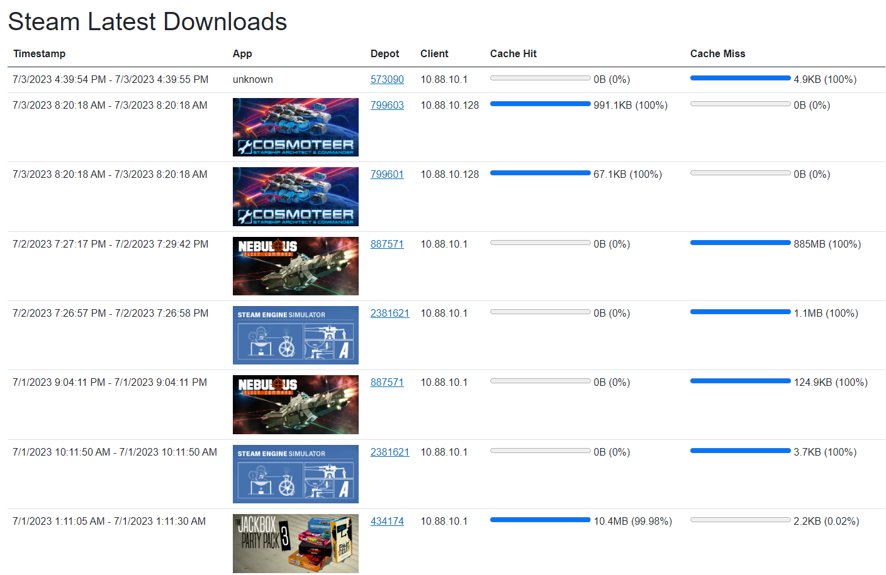

# DeveLanCacheUI_Backend
A UI for Lan Cache. Currently only supports Steam, but works quite nicely t.b.h.



## How to run this

```
version: '3'

services:
  develancacheui_backend:
    image: devedse/develancacheui_backend:latest
    restart: unless-stopped
    ports:
      - '7301:80'
    environment:
      - LanCacheLogsDirectory=/var/develancacheui/lancachelogs
      - DepotFileDirectory=/var/develancacheui/depotdir
      - ConnectionStrings__DefaultConnection=Data Source=/var/develancacheui/database/develancacheui.db;
    volumes:
      - "/home/pi/dockercomposers/develancacheui/backend/depotdir:/var/develancacheui/depotdir"
      - "/home/pi/dockercomposers/develancacheui/backend/database:/var/develancacheui/database"
      - "/mnt/mynas/DockerComposers/lancache/logs:/var/develancacheui/lancachelogs:ro"
  develancacheui_frontend:
    image: devedse/develancacheui_frontend:latest
    restart: unless-stopped
    ports:
      - '7302:80'
    environment:
      - BACKENDURL=https://develancacheui_api.devedse.duckdns.org
```

Steps:
1. Create/mount the relevant directories
2. Run the docker-compose file
3. Copy paste the app-depot-output.csv file in the mounted `depotdir`. This will automatically fill the database with all Depot => App mappings
4. Github Sponsor me 5k euro's kthnx
5. Profit

## Issue: My access.log file is updated but my DeveLanCacheUI_Backend isn't reading the new lines

So apparently if the access.log file is in a SMB Share which is mounted in docker (as is the case for me) the DeveLanCacheUI_Backend application takes a READ lock on the share. This apparently lets CIFS decide that no other applications will write to this file which allows it to cache things.
If you manually execute the `ls` command in the lancachelogs directory it will in fact start reading the file again.

To work around this issue you need to add `cache=none` to the CIFS mount in `/etc/fstab`:
```
//192.168.2.201/DockerComposers /mnt/mynas/DockerComposers cifs credentials=/home/pi/.mynascredentialssmb,iocharset=utf8,vers=3.0,sec=ntlmssp,cache=none 0 0
```

References:
https://stackoverflow.com/questions/14920591/how-to-disable-caching-in-cifs-samba-on-client-side-in-linux
https://www.samba.org/samba/docs/old/Samba3-HOWTO/locking.html
https://linux.die.net/man/8/mount.cifs

## Progress / Plans

| Task | Progress |
|:----:|:--------:|
| Automated Deployments | 90% |
| Dockerization | 90% |
| Implement other protocols besides steam | 0% |
| Auto refresh | 0% |
| More data things | 0% |

## Build status

| GitHubActions Builds |
|:--------------------:|
| [](https://github.com/devedse/DeveLanCacheUI_Backend/actions/workflows/githubactionsbuilds.yml) |

## DockerHub

| Docker Hub |
|:----------:|
| [](https://hub.docker.com/r/devedse/develancacheui_backend/) |

## Code Coverage Status

| CodeCov |
|:-------:|
| [](https://codecov.io/gh/devedse/DeveLanCacheUI_Backend) |

## Code Quality Status

| SonarQube |
|:---------:|
| [](https://sonarcloud.io/dashboard?id=DeveLanCacheUI_Backend) |

## Package

| NuGet |
|:-----:|
| [](https://www.nuget.org/packages/DeveLanCacheUI_Backend/) |
